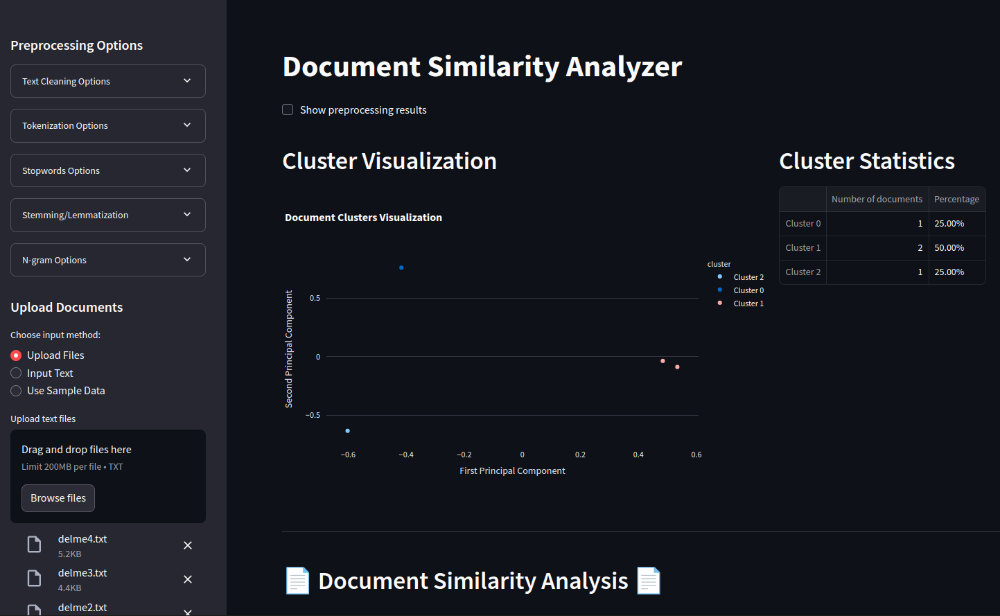

# Document Similarity Analyzer

Welcome to the Document Similarity Analyzer, a streamlit application exercising document comparison techniques

## Screenshot

## Features

- **Preprocessing Options**: Clean and prepare your text with options like lowercase conversion, punctuation removal, and more. It's like giving your documents a fresh shave and a clean suit.
- **Tokenization and N-grams**: Choose how to split your text and decide on n-gram sizes. It's like choosing your weapon before a heist.
- **Clustering and Visualization**: Group similar documents and visualize them with style. See your documents form clusters like a gang of misfits plotting their next move.
- **Similarity Metrics**: Dive deep into the numbers with cosine, Euclidean, Jaccard, and centroid similarities. It's all about the details, darling.
- **Export Results**: Take your findings with you in JSON or CSV format. Because a good detective always shares their case files.

## Installation

1. Clone the repo: `git clone https://github.com/yourusername/DocumentClassifier.git`
2. Navigate to the project directory: `cd DocumentClassifier`
3. **Optional**: setup virtual environment `python3 -m venv venv` or `virtualenv venv` then `source venv/bin/activate`
4. Install the requirements: `pip install -r requirements.txt`
5. **REQUIRED** Download nltk data (once per install) `python download_nltk.py`

## Usage

1. Fire up the app: `streamlit run main.py`
2. Upload your documents or use the sample data.
3. Configure your preprocessing settings in the sidebar.
4. Analyze the clusters and similarity metrics.
5. Export the results and bask in the glory of your findings.

## Contributing

Feel like adding a new feature or fixing a bug? Fork the repo, make your changes, and submit a pull request. 

## License

This project is licensed under the MIT License. Because even in the shadows, we play fair.

